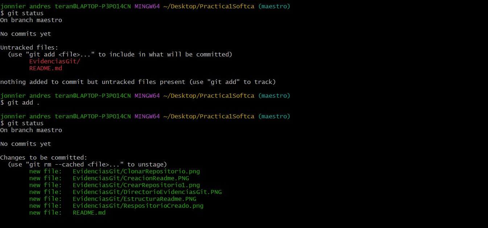
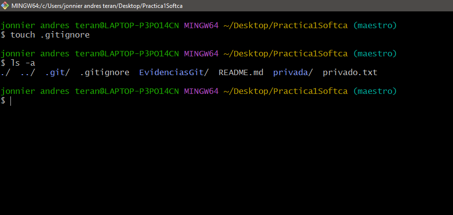

# PRESENTACION:
# SEMILLERO DE DESARROLLO DE SOFTWARE
## SOFTCARIBEAN
## PRACTICA 1
## GIT Y GITHUB

## De: Ing. Jonnier Andrés Terán Morales
## Año 2023

# --------------------------------------------------------------------------
#### Nota: Se creo en el repositorio una carpeta llamada evidenciasGit para guardar todas las evidencias de la ejecucion de la practica.

# Desarrollo de la practica 1 git-gitHub:
## - Crear repositorio
1. Crear un repositorio en vuestro GitHub llamado Practica1Softca
    - Descripción: Se crea un repositorio remoto en GitHub, el cual   llevara por nombre Practica1Softca.	
    - Evidencia: 
        - 
        - 

2. Clonar vuestro repositorio en local.
-	Comando implementado:  
~~~
    - git clone https://github.com/JonnierTeran/Practica1Softca.git
~~~
-	Descripción: 
    - git clone url, Este comando nos permite clonar nuestro repositorio Remoto en un Repositorio de forma Local en el directorio en que estemos ubicados con nuestra terminal de comandos.
-	Evidencia: 
    - Principalmente nos ubicamos en nuestro escritorio, luego ejecutamos nuestro comando para clonar el repositorio remoto de GitHub, posteriormente accedemos a la carpeta que se ha creado al clonar el repositorio y procedemos a listar todos sus elementos, incluidos los elementos ocultos y podemos observar una carpeta .git La cual es oculta y contiene nuestro repositorio.
    - 

# README
3. Crear (si no lo habéis creado ya) en vuestro repositorio local un documento README.md.
    * Notas: en este documento tendrán que ir poniendo los comandos
    * que han tenido que utilizar durante todos los ejercicios
    * y las explicaciones y capturas de pantalla que consideres necesarias.

-  Comando implementado:  
~~~
    - touch README.md
~~~
-	Descripción: 
    - touch README.md, Este comando nos permite crear un archivo vacido, con el nombre y la extension que indiquemos.
-	Evidencia: 
    - Luego de generar el archivo README.md procedemos a listar todos el contenido del directorio, incluyendo los archivos ocultos del mismo y accedemos a abrir nuestro archivo README.md en nuestro editor de codigo Visual Studio Code.
    - 

# Commit inicial
4. Añadir al README.md los comandos utilizados hasta ahora y hacer un commit inicial con el mensaje commit inicial.
-  Comando implementado:  
~~~
    - git add . / git commit -m "initial commit"
~~~
-	Descripción: 
    - git add . , nos permite Agregar todos los Archivos que queremos añadir al el "staging" o area de preparación, y con git commit -m "initial commit" confirmamos los cambios y los guardamos en el repositorio de forma local.
-	Evidencia: 
    - Luego de generar el archivo README.md y abrirlo en visual studio code, procedemos a insertar todos los comandos y evidencias que llevamos hasta el momento, y procedemos a agregar el archivo al Area de preparacion y luego confirmamos los cambios con el primer commit.
    - 
    - 
    - 

# Push inicial
5. Subir los cambios al repositorio remoto.
-  Comando implementado:  
~~~
    - git push -u origin maestro
~~~
-	Descripción: 
    - git push -u origin maestro, Este comando envia los commits que tengamos en nuestra rama maestro hacia la rama maestro del repositorio remoto, agregandoe el parametro -u para realizar un seguimiento a la rema remota y rama local que queremos enviar. 
-	Evidencia: 
    - Luego de hacer nuestro primer commit, procedemos a enviarlo  del repositorio local, al repositorio Remoto.
    - 
    - 

# Ignorar archivos
6. Crear en el repositorio local un fichero llamado privado.txt.
-  Comando implementado:  
~~~
    - touch privado.txt
~~~
-	Descripción: 
    - touch privado.txt, nos permite crear un archivo llamado privado y que sea de estension txt.
-	Evidencia: 
    - Luego de ejecutar el comando touch privado.txt podemos mirar que se a agregado un nuevo archivo a nuestro directorio.
    - 

7. Crear en el repositorio local una carpeta llamada privada.
-  Comando implementado:  
~~~
    - mkdir privada
~~~
-	Descripción: 
    - mkdir privada, nos permite crear una nueva carpeta dentro de nuestro directorio raiz.
-	Evidencia: 
    - Luego de ejecutar el comando mkdir privada podemos mirar que se a agregado una nueva carpteta  a nuestro directorio.
    - 
8. Realizar los cambios oportunos para que tanto el archivo como la carpeta sea ignorada por git.
-  Comando implementado:  
~~~
    - touch .gitignore
~~~
-	Descripción: 
    - touch .gitignore, nos permite crear un archivo oculto de texto plano, donde podremos listar todos los archivos y rutas que queremos que sean ignoradas por git.
-	Evidencia: 
    - Luego de ejecutar el comando touch .gitingnore procedemos a abrir el archivo en nuestro editor y listar los archivos que no querermos que sean rastreados por git, lugo miraremos el estado del repositorio y veremos que el archivo privado.txt y la carpeta privada no sean leidos por el repositorio.
    - 
    - Archivos que seran ignorados:
    - 
    - Status del repositorio, donde ignora los archivos privado.txt y la carpeta privada creados anteriormente
    - 

# Añadir fichero 1.txt
9. Añadir fichero 1.txt al repositorio local.
-  Comando implementado:  
~~~
    - touch 1.txt
    - git add 1.txt
~~~
-	Descripción: 
    - touch 1.txt, nos permite crear un nuevo archivo llamado 1.txt
    - git add 1.txt nos permite agregar al repositorio local nuestro archivo 1.txt
-	Evidencia: 
    - Luego de ejecutar crear el archivo y ejecutar el comando git add 1.txt podemos mirar que se a agregado con exito el archivo 1.txt a nuestro repositorio.
    - 

# Crear el tag v0.1
10. Crear un tag v0.1.
-  Comando implementado:  
~~~
    - git tag V0.1 <commit>
~~~
-	Descripción: 
    - git tag commit, nos permite crear un tag y hacer referencia a un commit especifico.
-	Evidencia: 
    - Luego de ejecutar el comando git tag commit, hemos realizado una referencia en el historial de nuestro repositorio, y podemos verla en git tag.
    - Vemos nuestros commits y elegimos el commit que queremos enlzar al tag v0.1
    - 
    - Creamos nuestro tag v0.1
    - 

# Subir el tag v0.1
11. Subir los cambios al repositorio remoto.
-  Comando implementado:  
~~~
    - git push origin --tags
    - git push -u origin maestro
~~~
-	Descripción: 
    - git push origin --tags, nos permite enviar los tags creados en el repositorio local al repositorio remoto en github.
-	Evidencia: 
    - Luego de ejecutar el comando  git push origin --tags, se envian los tags al repositorio remoto en github.
    - enviamos el tag v0.1 al repositorio Remoto
    - 
    - Subimos cambios al repositorio remoto
    - 
    - Vemos tag en github
    - 

# Crear una rama v0.2
12.  Crear una rama v0.2.
-  Comando implementado:  
~~~
    - git branch v0.2
~~~
-	Descripción: 
    - git branch v0.2, nos permite crear una rama de trabajo en nuestro repositorio.
-	Evidencia: 
    - Creamos una nueva rama de trabajo con git branch v0.2.
    - 

13. Posiciona tu carpeta de trabajo en esta rama.
-  Comando implementado:  
~~~
    - git checkout v0.2
~~~
-	Descripción: 
    - git checkout v0.2, nos permite posicionarnos en la rama v0.2 de nuestro repositorio.
-	Evidencia: 
    - nos posicionamos en la rama v0.2
    - 

# Añadir fichero 2.txt
14. Añadir un fichero 2.txt en la rama v0.2.
-  Comando implementado:  
~~~
    - touch 2.txt
~~~
-	Descripción: 
    - touch 2.txt nos permite crear un archivo vacido con su nombre y extension 2.txt
-	Evidencia: 
    - creamos un archivo en la nueva rama creada 
    - 

# Crear rama remota v0.2
15. Subir los cambios al repositorio remoto.
-  Comando implementado:  
~~~
    - git push -u origin v0.2
~~~
-	Descripción: 
    - git push -u origin v0.2, nos permite enviar al repositorio remoto, la rama v0.2 y sus cambios.
-	Evidencia: 
    - Subimos cambios al repositorio Remoto
    - 
    - Repositorio remoto
    - 

16. Posicionarse en la rama master.
-  Comando implementado:  
~~~
    - git checkout maestro
~~~
-	Descripción: 
    - git checkout maestro, nos permite posicionarnos en la rama principal de nuestro repositorio.
-	Evidencia: 
    - Posicionar en rama principal
    - 

# Merge directo
17. Hacer un merge de la rama v0.2 en la rama master.
-  Comando implementado:  
~~~
    - git merge v0.2
~~~
-	Descripción: 
    - git merge v0.2, nos permite unir las 2 ramas de nuestro repositorio.
-	Evidencia: 
    - Merge directo
    - 

# Merge con conflicto
18. En la rama master poner Hola en el fichero 1.txt y hacer commit.
-  Comando implementado:  
~~~
    - git commit
~~~
-	Descripción: 
    - agregamos Hola en el fichero y agregamos y Confirmamos los cambios en el archivo 1.txt de la rama maestro
-	Evidencia: 
    - Agregamos texto al archivo 1.txt de la rama maestro
    - 
    - agregamos y confirmamos los cambios en la rama maestro
    - 

19. Posicionarse en la rama v0.2 y poner Adios en el fichero &quot;1.txt&quot; y hacer commit.
-  Comando implementado:  
~~~
    - git checkout v0.2
    - git add .
    - git commit -m "Message"
~~~
-	Descripción: 
    - cambiamos de la rama maestro a la rama v0.2 y  agregamos en el fichero 1.txt el mensaje de "ADIOS", agregamos al area de preparacion y confirmamos los cambios en la rama v0.2
-	Evidencia: 
    - Cambio de rama
    - 
    - Agregamos texto al archivo 1.txt de la rama v0.2
    - 
    - agregamos y confirmamos los cambios en la rama v0.2
    - 
    
20. Posicionarse de nuevo en la rama master y hacer un merge con la rama v0.2
- merge con conflcito
-  Comando implementado:  
~~~
    - git checkout maestro
    - git merge v0.2
~~~
-	Descripción: 
    - git checkout maestro nos posicionamos en maestro nuevamente.
    - git merge v0.2, nos permite unir las 2 ramas de nuestro repositorio
    Obtenemos un conflicto ya que hemos modificado el mismo archivo en el mismo espacio.
-	Evidencia: 
    - rama maestro
    - 
    - Merge con conflicto en git
    - 

# Listado de ramas
21. Listar las ramas con merge y las ramas sin merge.
-  Comando implementado:  
~~~
    - git branch --merged
    - git branch --no-merged
~~~
-	Descripción: 
    - con los anteriores comandos vemos las ramas con merge y las ramas sin merge
    Obtenemos un conflicto ya que hemos modificado el mismo archivo en el mismo espacio.
-	Evidencia: 
    - rama con merge
    - 
    - ramas sin merge (obvervamos que no hay ramas sin merge a la rama actual)
    - 

# Arreglar conflicto
22. Arreglar el conflicto anterior y hacer un commit.
    - Merge con conflicto en git
    - 
    - Vemos el conflicto en visual studio code
    - 
    - Solucionamos el conflicto eligiendo uno de los cambios, elegiremos el Hola de la rama maestro
    - 
    - commit para solucionar conflictos
    - 

# Borrar rama
23. Crear un tag v0.2
-  Comando implementado:  
~~~
    - git tag V0.2 <commit>
~~~
-	Descripción: 
    - git tag x commit, nos permite crear un tag y hacer referencia a un commit especifico.
-	Evidencia: 
    - Luego de ejecutar el comando git tag commit, hemos realizado una referencia en el historial de nuestro repositorio, y podemos verla en git tag.
    - Vemos nuestros commits y elegimos el commit que queremos enlzar al tag v0.2
    - 
    - Creamos nuestro tag v0.2
    - 

24. Borrar la rama v0.2
-  Comando implementado:  
~~~
    - git branch -d v0.2
~~~
-	Descripción: 
    - git branch -d v0.2, nos permite eliminar una rama indicada
-	Evidencia: 
    - Luego de ejecutar el comando git branch -d v0.2, hemos eliminado la rama v0.2
    - 

# Listado de cambios
25. Listar los distintos commits con sus ramas y sus tags.
-  Comando implementado:  
~~~
    - git config --global alias.list 'log --oneline --decorate --graph --all'
    - git list
~~~
-	Descripción: 
    - colocamos un alias al comando list y ejecutamos
-	Evidencia: 
    - Luego de ejecutar el comando git branch -d v0.2, hemos eliminado la rama v0.2
    - 

# F I N - D E - L A - A C T I V I D A D